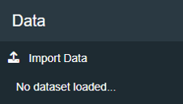
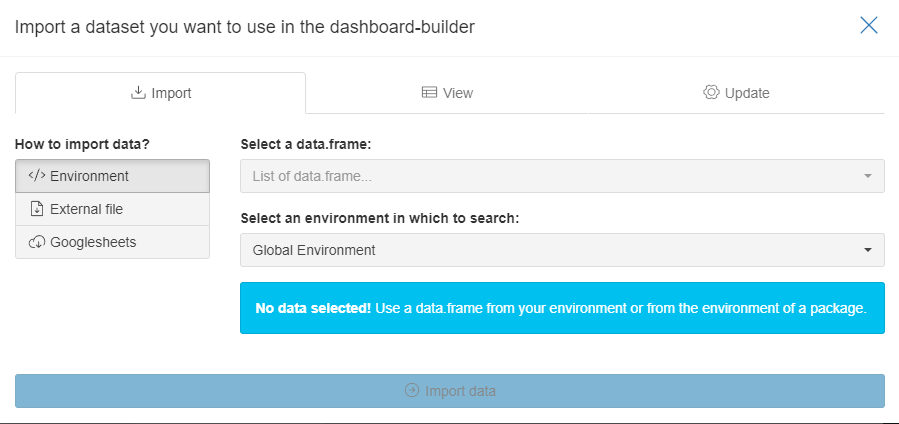

```{r, include = FALSE}
knitr::opts_chunk$set(
  collapse = TRUE,
  comment = "#>"
)
```
In this article, we explain the first step, how to add data to the Dashboard-Builder.


In the right sidebar you can find the "Import Data" button and a textbox showing you the name of the current dataset.

Clicking on *Import Data* opens the *Data Import Dialogue* displayed below.

<br>


You can import data from the current R-Environment, Google Sheets, and load external files like *.csv*, *.xlsx*, etc.


Once you have loaded your dataset you can continue with [Step 2: Create Elements](step2_createElements.html)
