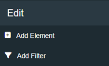
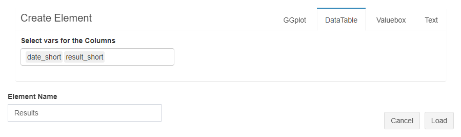

```{r, include = FALSE}
knitr::opts_chunk$set(
  collapse = TRUE,
  comment = "#>"
)
```

In this article, we explain the second step, how to create and edit elements.


In the right sidebar you can find the "Add Element" and "Add Filter" buttons.

Clicking on *Add Element* opens the ** displayed below.

<br>


Once you have finished creating your dashboard you can continue with [Step 3: Export](step3_export.html)
